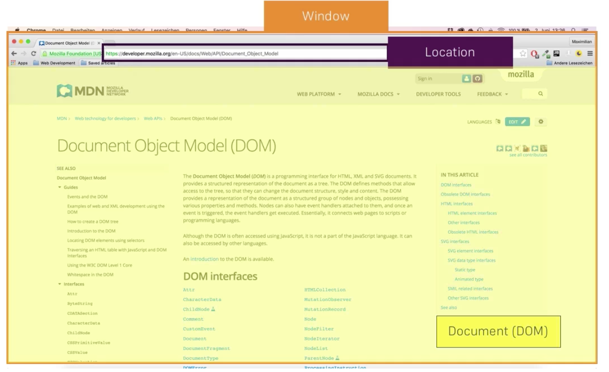

# DOM - document object model

The Document Object Model (DOM) connects web pages to scripts or programming languages. Usually that means JavaScript, but modelling HTML, SVG, or XML documents as objects is not part of the JavaScript language. The DOM model represents a document with a logical tree. Each branch of the tree ends in a node, and each node contains objects. DOM methods allow programmatic access to the tree; with them you can change the document's structure, style or content. Nodes can have event handlers attached to them. Once an event is triggered, the event handlers get executed.
* https://developer.mozilla.org/en-US/docs/Web/API/Document_Object_Model

